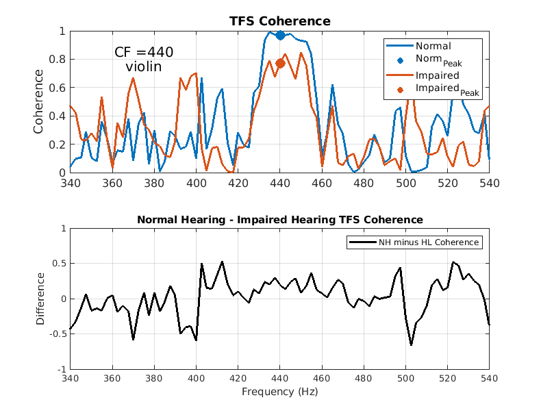
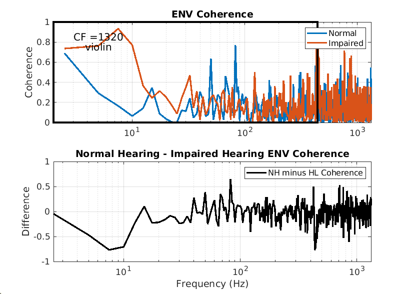
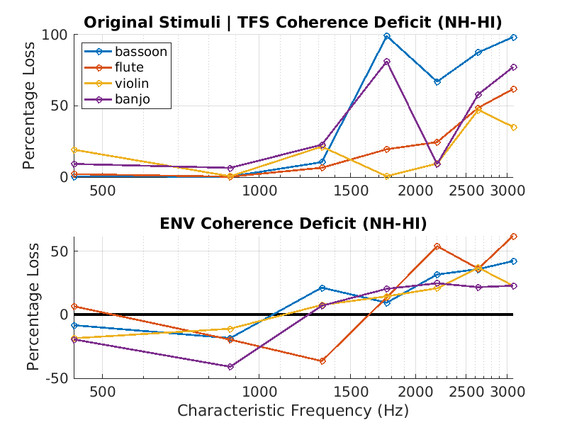
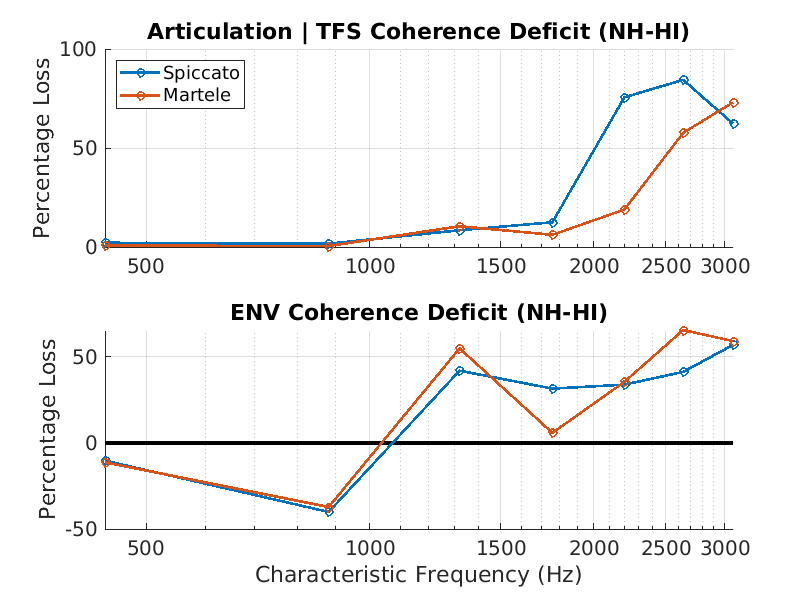
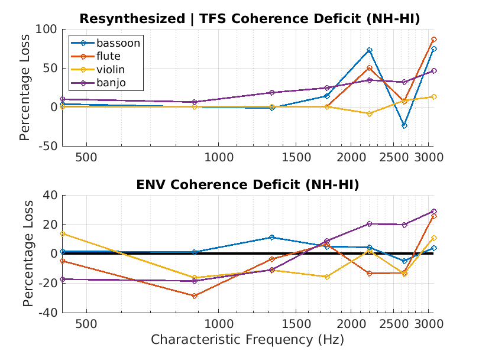

# The Role of Envelope and Temporal Fine Structure in Auditory Neural Coding of Timbre in Normal and Impaired Hearing

 **Andrew Sivaprakasam** (asivapr@purdue.edu)

*Weldon School of Biomedical Engineering, Purdue University, West Lafayette, IN*

---

Here, a framework for examining and testing the role of temporal envelope (ENV) and fine structure (TFS) in the peripheral coding of *timbre* has been outlined. Timbre is a rather complex perceptual phenomenon that is difficult to study because timbral qualities are challenging to contextualize within the realm of physics and mathematics. What is known, however, is that the fidelity of the representation of sound by the auditory nerve is subject to impairment following hearing loss.

Therefore, a particular question emerges-- **is our coding and perception of timbre impacted by hearing loss?**

The code provided allows the user to either provide real-world sounds or generate synthetic stimuli with variable timbre and look at how coding of ENV and TFS features of these stimuli is effected with varying degrees and types of hearing loss. While ENV and TFS are quite possibly an oversimplified way to look at timbre, it is a start.

---
## Methods

The methods are summarized by the below diagram.

### Code Synopsis:

`Main.m` - The main script for running the Auditory Nerve (AN) model to conduct the above analysis

`inspectTone.m` & `spectralProperties.m` - Handy scripts for identifying spectral and temporal characteristics of your stimuli

`/stimulus_generation` - Collection of bespoke Python scripts to resynthesize stimuli in a more quantitative fashion based on spectral properties:

`/BEZ2018` - The Bruce, Erfani, and Zilany 2018 [Auditory Nerve model](https://github.com/yousoferfani/BEZ_model).

*Feel free to run your own stimuli or create new ones using these tools!!!*

---
## Sample Figures:

I chose to compare the coding of four different instrumental sounds with distinct timbral characteristics ([original recordings](https://philharmonia.co.uk/resources/sound-samples/) and resynthesized stimuli). I also compared the coding of two different articulations played on the violin, *spiccato* and *martele*. All stimuli had the same pitch (440Hz/A4). I simulated a flat 40 dB hearing loss (using a mix of Inner Hair Cell (IHC) and Outer Hair Cell (OHC) impairment) at all cochlear regions for simplicity. In the hearing-impaired condition, a compensatory volume increase of 40 dB was added.

To quantify coding deficits across auditory neurons of varying CF, I chose to look at the difference between the normal and impaired hearing coherence at each CF. TFS deficit (Percentage Loss) was quantified as the percent difference at each harmonic of 440 Hz in the TFS coherence spectrum, and ENV deficit was quantified as the mean coherence difference in a 0-440Hz band in the ENV coherence spectrum.

The results across instruments were also visualized. TFS coherence tends to worsen with impaired hearing, despite the compensatory 40 dB increase. ENV coherence tends to be enhanced at low CFs with hearing impairment, but is degraded at CFs>1320 Hz. These findings could be in part explained by broadened tuning of the cochlear channels from OHC damage. Since filtering is normally narrow at low frequencies it makes sense that ENV coding is enhanced at low frequencies. At high frequencies, broadened tuning is normal, and pitch is unresolved, resulting in more ENV coding. In this case the ENV coding may be weaker in impaired hearing because of impaired IHC-related transduction of sound.

Note that the **TFS and ENV coherence varies depending on the instrument and articulation**. Therefore, it may be possible that our ability to differentiate between instrumental sounds using timbre may be impacted differently depending on the sound itself. For example, maybe we can distinguish a violin's sound better than that of a bassoon, even if we have hearing loss.  
